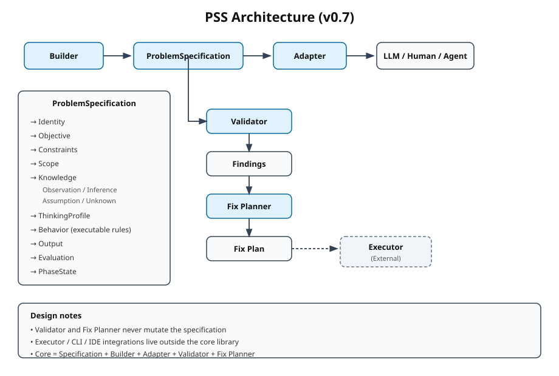

# PSS — Problem Specification System

**PSS is a shared specification of thinking conditions** for humans, agents, and LLMs.

> PSS does not solve problems.  
> PSS defines the conditions under which problems are thought about.

It is not a prompt template.  
It is not an agent framework.  
It is a lightweight, model-independent library for writing, validating, and improving problem specifications.

---

## Architecture



See also: [docs/architecture.svg](docs/architecture.svg)

---

## Core Principle

```text
PSS does not solve problems.
PSS defines problems.
PSS produces a Problem Specification.
Primary I/O can be a PLP Capsule (optional).
Phase transitions and behavior rules are owned by the program, not the LLM.
```

The same specification can be read by a human, an agent, or an LLM.  
This is the main reason PSS exists.

---

## Layers

PSS keeps responsibilities strictly separated:

| Layer            | Responsibility                              |
|------------------|---------------------------------------------|
| **Specification**| What is defined (data structures)           |
| **Builder**      | How to construct a specification            |
| **Adapter**      | How to present it to an LLM                 |
| **Validator**    | What is wrong or incomplete (diagnosis only)|
| **Fix Planner**  | How to fix it (plan only, no side effects)  |

Executor, CLI, and IDE integrations are intentionally **outside** the core.  
They should live in separate packages if needed.

---

## Structure of a Specification

```text
ProblemSpecification
├── Identity
├── Objective          (Goal / Current State / Difference)
├── Constraints        (Hard / Soft / Assumptions / Risks)
├── Scope
├── Knowledge          (Observation / Inference / Assumption / Unknown / Missing)
├── ThinkingProfile
├── Behavior           (executable rules: if_unknown, if_assumption, …)
├── Output
├── Evaluation
└── PhaseState
```

**Behavior** is deliberately written as executable rules, not decorative labels:

```yaml
rules:
  if_unknown: answer_unknown
  if_assumption: mark_assumption
  if_scope_violation: stop
  if_missing_required: ask
  if_low_confidence: state_confidence
```

**Knowledge** separates observation from inference to reduce premature conclusions.

---

## Basic Usage

```python
from pss import ProblemBuilder, validate, plan_fixes, compile_for_generic

# 1. Build
spec = (
    ProblemBuilder()
    .identity(title="進捗報告資料の作成", domain="business.document")
    .goal(description="会議で使える完成度の高い資料を提出する")
    .knowledge(
        observation=["会議は来週火曜", "Wordで提出"],
        unknown=["正式な出力フォーマット"],
    )
    .behavior(
        role="collaborator",
        if_unknown="answer_unknown",
        if_assumption="mark_assumption",
    )
    .phase(phase="1_clarify")
    .build()
)

# 2. Validate
report = validate(spec)
print(report.summary())

# 3. Plan fixes (if needed)
if report.overall.value != "PASS":
    plan = plan_fixes(report)
    print(plan.summary())

# 4. Compile for an LLM
prompt = compile_for_generic(spec)
```

---

## Lifecycle

```text
Builder          → write specification
Validator        → diagnose (PASS / WARN / ERROR)
Fix Planner      → produce Fix Plan (pure data)
Executor*        → human / LLM / IDE / CI applies the plan
```

\* Executor is **not** part of the core library.

Validator never mutates the specification.  
Fix Planner never mutates the specification.  
Both return pure data so that different tools can consume them safely.

---

## Design Decisions (Why these boundaries)

- **No Executor in core**  
  Keeps PSS a specification library. Execution strategies differ by environment.

- **Severity stays simple**  
  `ERROR` / `WARN` / `INFO` is enough for now.  
  Finer levels (`blocker` etc.) can be added later without breaking existing code.

- **Behavior as rules, not roles alone**  
  Roles are useful, but concrete `if_…` rules reduce model-to-model variance.

- **Observation vs Inference**  
  Most LLMs jump from observation to inference unconsciously.  
  Explicit separation makes “I don’t know” and “I am assuming” visible.

---

## Relationship with PLP

PSS can be used completely standalone.

When systems need to exchange structured information, a PSS specification can be placed inside a PLP Capsule without changing the thinking conditions themselves.

```text
PSS  → standalone thinking-condition framework
PLP  → transport & interoperability layer (optional)
```

---

## Status & Stability

- Current version: **0.7**
- Core schema: `pss.problem_specification/0.6`
- Public API is approaching **v1.0** stability.

From this point forward the priority is:

1. Freeze the public API surface
2. Unify naming
3. Strengthen tests and examples
4. Keep the core small

New major features will be added cautiously and preferably in satellite packages.

---

## License

Non-Commercial / Non-Military License
